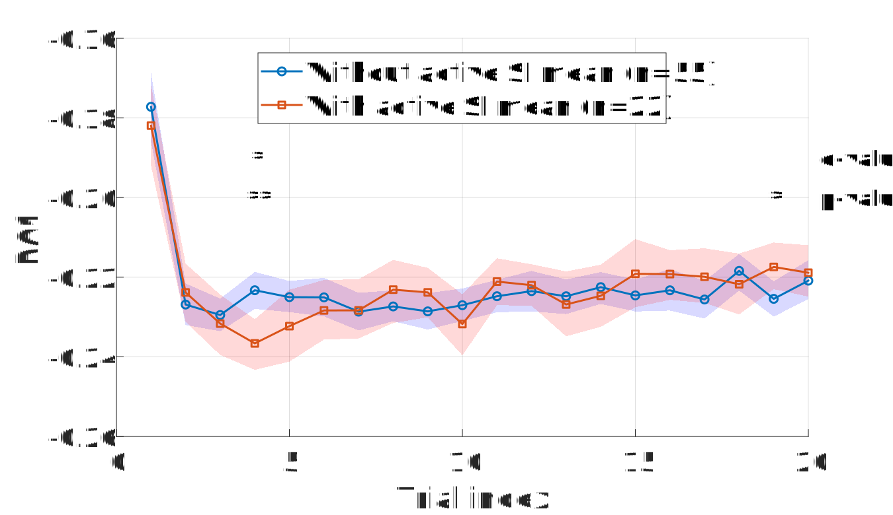
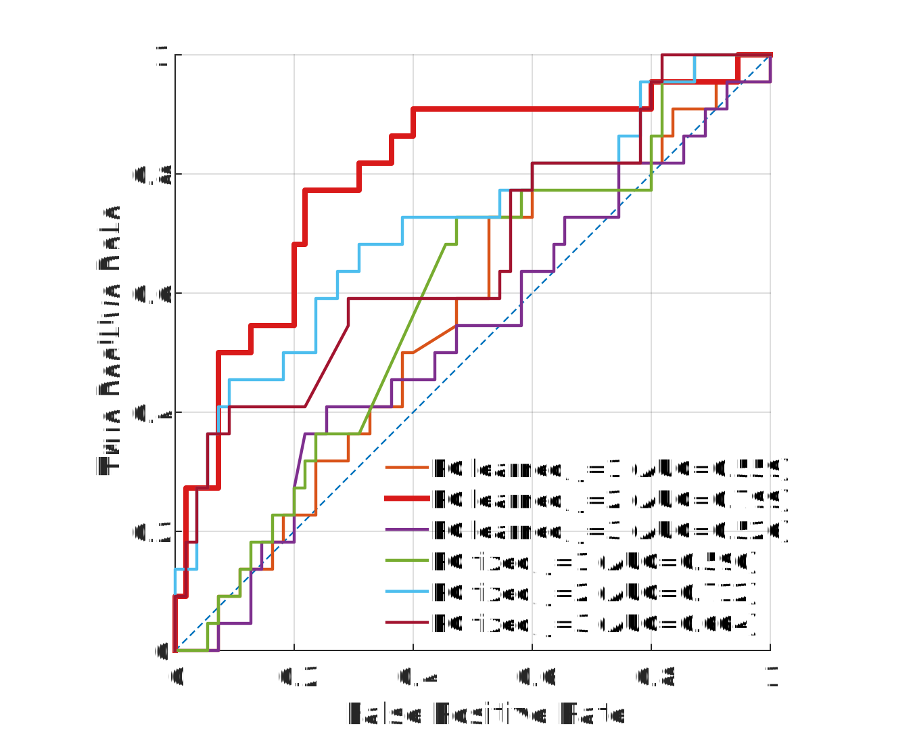
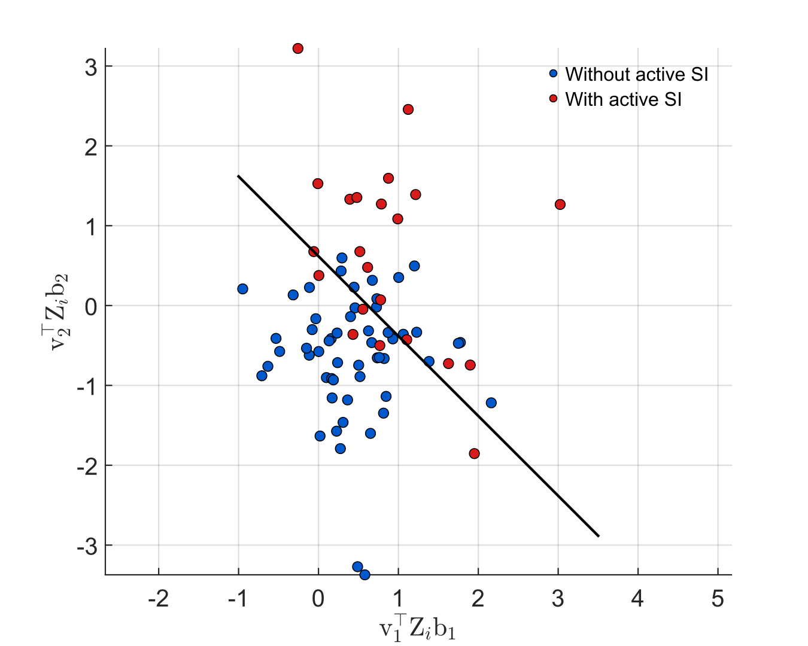

# Near-Term Suicidality Risk Encoded in the Temporal Dynamics of the Death IAT

Computational modeling pipeline for detecting **near-term suicidality risk** from reaction-time dynamics in the **Brief Death Implicit Association Test (BDIAT)**.

The repository implements a full analysis pipeline that extracts **latent temporal structure in reaction-time behavior** using PCA, autocorrelation analysis, and sparse bilinear logistic regression. These temporal features reveal behavioral signatures associated with suicidal ideation and enable predictive classification with **77% balanced accuracy**.

---

# Overview

Traditional analyses of the Implicit Association Test (IAT) rely on aggregate metrics such as the **D-score** ([Fig. 2A](Figures/Figure_2_A.svg))([Fig. 2B](Figures/Figure_2_B.svg)), which summarize reaction times across blocks.
In contrast, this project investigates the **temporal dynamics of reaction-time behavior**, capturing how responses evolve across trials and blocks. By modeling these temporal patterns, we uncover latent behavioral structure that differentiates individuals **with active suicidal ideation from those without**.

Key components of the analysis pipeline include:

- Reaction-time preprocessing and filtering
- Block-level autocorrelation analysis
- Trial-level latent structure extraction using PCA
- Spectral analysis of rhythmic response patterns
- Sparse bilinear logistic regression for classification

---

# Key Results

• Reaction-time series exhibit **structured temporal dynamics** across task blocks  
• Autocorrelation analysis reveals **rhythmic switching patterns** in behavioral responses  
• PCA identifies **low-dimensional latent dynamics** governing trial-by-trial adaptation  
• A sparse bilinear logistic model predicts suicidal ideation status with  
**77% balanced accuracy**

---

# Example Results

## Block-Level Temporal Structure

Autocorrelation analysis reveals structured rhythmic patterns in reaction-time dynamics across BD-IAT blocks. Participants without active suicidal ideation exhibit stronger rhythmic switching patterns across task blocks, suggesting greater sensitivity to the alternating structure of the task.

---

## Latent Temporal Dynamics

Principal component analysis reveals low-dimensional temporal structure within blocks of trials. The first principal component captures systematic trial-by-trial adjustment patterns that differentiate participants with and without active suicidal ideation.

---

## Model Performance

Receiver operating characteristic (ROC) curves comparing multiple classification models trained on temporal features derived from reaction-time dynamics. The bilinear logistic regression model achieves the highest performance, reaching approximately **77% balanced accuracy**.

---

## Latent Behavioral Embedding

Participants projected into the learned latent feature space derived from the bilinear model. The decision boundary separates individuals with and without active suicidal ideation, illustrating how temporal dynamics encode clinically relevant behavioral signatures.

---

## Model Benchmarking (Supplementary Figure S2)

We compared the proposed **Bilinear Logistic Regression model** against several machine learning baselines:

- Logistic Regression (L1 / L2)
- Linear SVM
- Multilayer Perceptron (MLP)
- Long Short-Term Memory (LSTM) Network
- 1D Convolutional Neural Network
- Transformer classifier
- LLM-embedding based classifier

The bilinear model achieves the best performance, reaching **AUC ≈ 0.80**, demonstrating the advantage of explicitly modeling the temporal structure of reaction-time dynamics.

---

# Repository Structure

Code/
Freud_Code_For_Block_Encoding/
Autocorrelation analysis and block-level modeling

Freud_Code_For_Temporal_Encoding/
Trial-level PCA analysis and temporal feature extraction

External/
COMPASS state-space toolbox dependency

Figures/
All publication figures (SVG format)

docs/
Manuscript and supplementary materials

---

# Running the Analysis

### 1. Add repository to MATLAB path

addpath(genpath('Near-Term-Suicidality-Risk-Encoded-in-the-Temporal-Dynamics-of-the-Death-IAT'))
### 2. Block-Level Temporal Analysis
Freud_Main_Block_Analysis

Generates the autocorrelation analyses corresponding to Figure 2.

### 3. Trial-Level Temporal Dynamics
Freud_PCA_Trial_Dynamics

Produces latent dynamics visualizations corresponding to Figure 3.

### 4. Classification Experiments
Freud_Plot_Model_Comparison

Runs classification models and generates ROC comparisons used in Figure 4.

### Requirements

Required software:

MATLAB (R2018b or newer)

Statistics and Machine Learning Toolbox

### Optional:

COMPASS State-Space Toolbox (included in External/)

# Data

The repository includes processed behavioral data required to reproduce the analyses:

Freud_Processed_BDIAT.mat

Raw cohort data is provided in:

Freud_Cohort_N80.xlsx

# Citation

If you use this code or analysis pipeline in your research, please cite:

Rajaii, P. et al.
Near-Term Suicidality Risk Encoded in the Temporal Dynamics of the Death IAT.
PNAS (under review).

# Contact

Pedram Rajaii
University of Houston
Department of Biomedical Engineering
