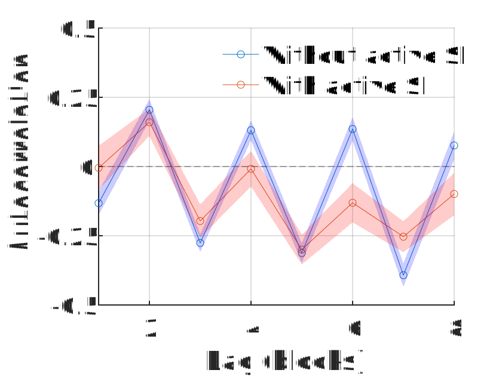
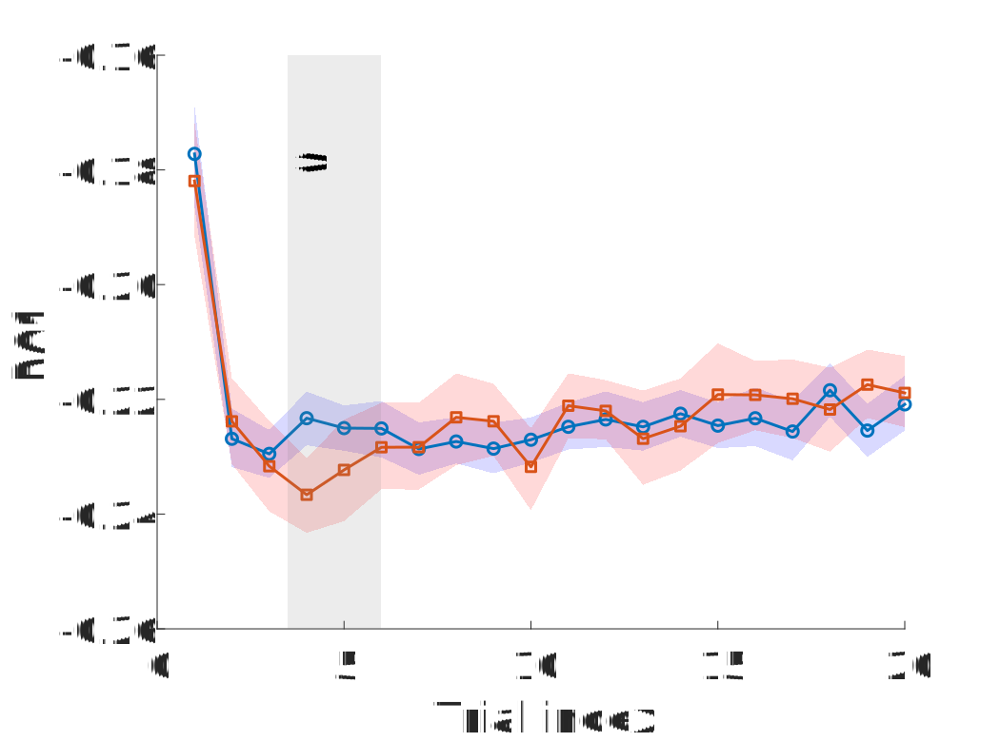
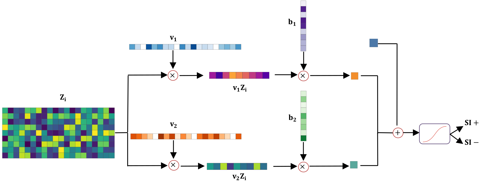
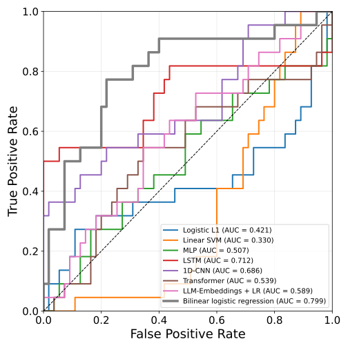

# Near-Term Suicidality Risk Encoded in the Temporal Dynamics of the Death IAT

Computational modeling pipeline for detecting **near-term suicidality risk** from reaction-time dynamics in the **Brief Death Implicit Association Test (BDIAT)**.

The repository implements a full analysis pipeline that extracts **latent temporal structure in reaction-time behavior** using PCA, autocorrelation analysis, and sparse bilinear logistic regression. These temporal features reveal behavioral signatures associated with suicidal ideation and enable predictive classification with **77% balanced accuracy**.

---

# Overview

Traditional analyses of the Implicit Association Test (IAT) rely on aggregate metrics such as the **D-score** ([Fig. 2A](figures/Figure_2_A.svg), [Fig. 2B](figures/Figure_2_B.svg)), which summarize reaction times across blocks.
In contrast, this project investigates the **temporal dynamics of reaction-time behavior**, capturing how responses evolve across trials and blocks. By modeling these temporal patterns, we uncover latent behavioral structure that differentiates individuals **with active suicidal ideation from those without**.

Key components of the analysis pipeline include:

- Reaction-time preprocessing and filtering
- Block-level autocorrelation analysis
- Trial-level latent structure extraction using PCA
- Spectral analysis of rhythmic response patterns
- Sparse bilinear logistic regression for classification

---

# Key Results

- Reaction-time series exhibit **structured temporal dynamics** across task blocks  
- Autocorrelation analysis reveals **rhythmic switching patterns** in behavioral responses  
- PCA identifies **low-dimensional latent dynamics** governing trial-by-trial adaptation  
- Behavioral time-series can be compressed into **low-dimensional latent embeddings (J = 2)** for robust clinical prediction  
- A sparse bilinear logistic model predicts suicidal ideation status with **77% balanced accuracy**

---

# Technical Implementation

### Bilinear Logistic Regression

Rather than flattening the reaction-time matrix, the model preserves the temporal structure of the BD-IAT task by using a bilinear form.

Let \(X \in \mathbb{R}^{m \times p}\) represent the reaction-time matrix for a participant, where \(m\) indexes task blocks and \(p\) indexes trial positions.

The probability of suicidal ideation is modeled as:

$$
P(y=1 \mid X) = \sigma \left( w_{time}^T X w_{space} + b \right)
$$

where:

- \(w_{time}\) captures **temporal weighting across trial positions**
- \(w_{space}\) captures **structure across task blocks**
- \(\sigma(\cdot)\) is the logistic sigmoid function

This formulation allows the model to learn **separable temporal and structural patterns** while dramatically reducing the number of parameters compared to a fully flattened classifier.

The resulting representation provides a **low-dimensional latent embedding of behavioral dynamics** used for classification.

---
# Example Results

## Block-Level Temporal Structure

Autocorrelation analysis reveals structured rhythmic patterns in reaction-time dynamics across BD-IAT blocks. Participants without active suicidal ideation exhibit stronger rhythmic switching patterns across task blocks, suggesting greater sensitivity to the alternating structure of the task.

## Latent Temporal Dynamics

Principal component analysis reveals low-dimensional temporal structure within blocks of trials. The first principal component captures systematic trial-by-trial adjustment patterns that differentiate participants with and without active suicidal ideation.

## Model Performance

Receiver operating characteristic (ROC) curves comparing multiple classification models trained on temporal features derived from reaction-time dynamics. The bilinear logistic regression model achieves the highest performance, reaching approximately **77% balanced accuracy**.

## Latent Behavioral Embedding

Participants projected into the learned latent feature space derived from the bilinear model. The decision boundary separates individuals with and without active suicidal ideation, illustrating how temporal dynamics encode clinically relevant behavioral signatures.

## Model Benchmarking (Supplementary Figure S2)

We compared the proposed **Bilinear Logistic Regression model** against several machine learning baselines:

- Logistic Regression (L1 / L2)
- Linear SVM
- Multilayer Perceptron (MLP)
- Long Short-Term Memory (LSTM) Network
- 1D Convolutional Neural Network
- Transformer classifier
- LLM-embedding based classifier

The bilinear model achieves the best performance, reaching **AUC ≈ 0.80**, demonstrating the advantage of explicitly modeling the temporal structure of reaction-time dynamics.

<!-- Repository Structure -->
<h2 id="repository-structure">Repository Structure</h2>

<pre><code>src/
├── block_dynamics/
│   └── Autocorrelation analysis and block-level modeling
│
├── trial_dynamics/
│   └── Trial-level PCA analysis and temporal feature extraction
│
├── external/
│   └── COMPASS state-space toolbox dependency
│
├── supplementary/
│   └── Supplementary Informantaions Analysis 
│
figures/
│   └── Publication figures (SVG format)
│
docs/
│   └── Manuscript and supplementary materials
</code></pre>

<!-- Running the Analysis -->
<h2 id="running-the-analysis">Running the Analysis</h2>

<h3 id="add-to-path">1. Add repository to the MATLAB path</h3>
<pre><code class="language-matlab">addpath(genpath('Near-Term-Suicidality-Risk-Encoded-in-the-Temporal-Dynamics-of-the-Death-IAT'))</code></pre>

<h3 id="block-level-analysis">2. Block-Level Temporal Analysis</h3>

Run the block-level autocorrelation analysis:

<pre><code class="language-matlab">Freud_Main_Block_Analysis</code></pre>

This script generates the analyses corresponding to <strong>Figure 2</strong>.

<h3 id="trial-level-dynamics">3. Trial-Level Temporal Dynamics</h3>

Run the PCA-based trial dynamics analysis:

<pre><code class="language-matlab">Freud_PCA_Trial_Dynamics</code></pre>

This produces the latent dynamics visualizations corresponding to <strong>Figure 3</strong>.

<h3 id="classification-experiments">4. Classification Experiments</h3>

Run the classifier benchmarking pipeline:

<pre><code class="language-matlab">Freud_Plot_Model_Comparison</code></pre>

This generates ROC comparisons used in <strong>Figure 4</strong>.

### Requirements

Required software:

MATLAB (R2018b or newer)

Statistics and Machine Learning Toolbox

### Optional:

COMPASS State-Space Toolbox (included in External/)

# Citation

If you use this code or analysis pipeline in your research, please cite:

Rajaii, P. et al.
Near-Term Suicidality Risk Encoded in the Temporal Dynamics of the Death IAT.
PNAS (under review).

# Contact

Pedram Rajaii
University of Houston
Department of Biomedical Engineering
