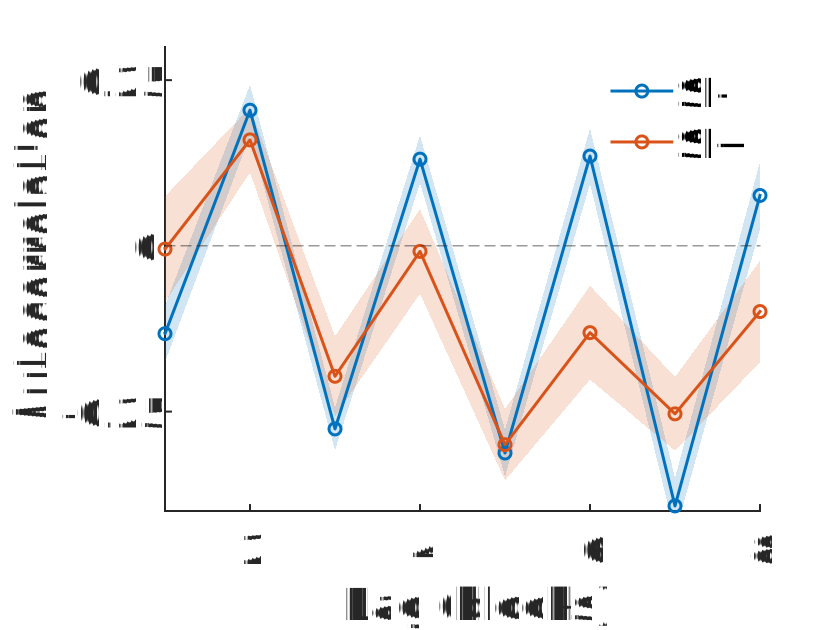
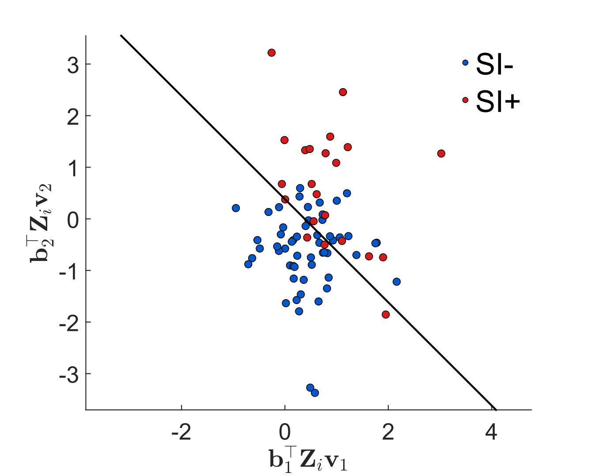

## Block-Level Temporal Structure

Autocorrelation analysis reveals structured rhythmic patterns in reaction-time dynamics across BD-IAT blocks. Participants without active suicidal ideation exhibit stronger rhythmic switching patterns across task blocks, suggesting greater sensitivity to the alternating structure of the task.

## Latent Temporal Dynamics

Principal component analysis reveals low-dimensional temporal structure within blocks of trials. The first principal component captures systematic trial-by-trial adjustment patterns that differentiate participants with and without active suicidal ideation.

## Model Performance

Receiver operating characteristic (ROC) curves comparing multiple classification models trained on temporal features derived from reaction-time dynamics. The bilinear logistic regression model achieves the highest performance, reaching approximately **77% balanced accuracy**.

## Latent Behavioral Embedding

Participants projected into the learned latent feature space derived from the bilinear model. The decision boundary separates individuals with and without active suicidal ideation, illustrating how temporal dynamics encode clinically relevant behavioral signatures.

<h3 id="block-level-analysis">2. Block-Level Temporal Analysis</h3>

Run the block-level autocorrelation analysis:

<pre><code class="language-matlab">
Freud_Main_Block_Analysis
</code></pre>

This script reproduces the block-level temporal structure analyses shown in:

<ul>
<li><strong><a href="figures/Figure_2_D.svg">Figure 2D</a></strong> — Block autocorrelation dynamics</li>
<li><strong><a href="figures/Figure_2_E.svg">Figure 2E</a></strong> — Rhythmic switching structure</li>
</ul>

<h3 id="classification-experiments">4. Classification Experiments</h3>

Run the classifier benchmarking pipeline:

<pre><code class="language-matlab">
Freud_Plot_Model_Comparison
</code></pre>

This script reproduces the classification results shown in:

<ul>
<li><strong><a href="figures/Figure_4_B.svg">Figure 4B</a></strong> — ROC comparison across models</li>
<li><strong><a href="figures/Figure_4_C.svg">Figure 4C</a></strong> — Latent behavioral embedding</li>
<li><strong><a href="figures/Figure_S2.svg">Figure S2</a></strong> — Model benchmarking</li>
</ul>
